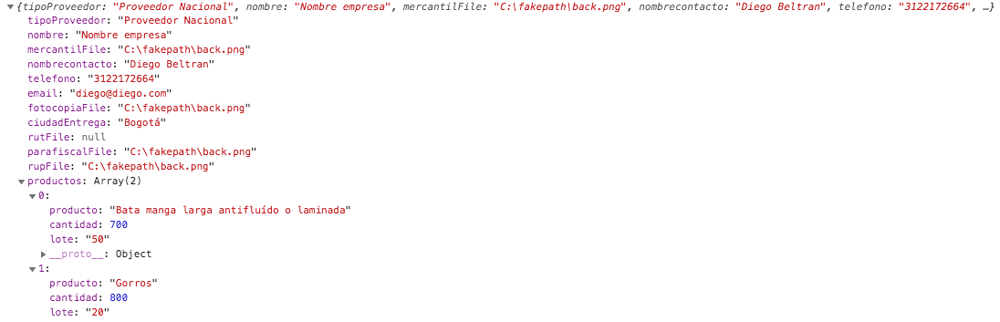
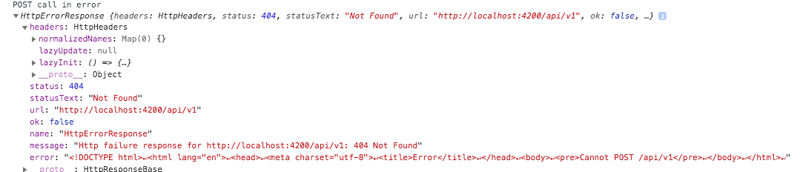

# Front End Ungrd
Se encuentra el proyecto en angular 9 y bootstrap 4  
Esta son las rutas del proyecto   

Corre el comando ng serve 
Ve a la ruta http://localhost:4200/  

Angular CLI: 9.1.1 
Node: 12.16.2 
OS: darwin x64  

Angular:  
...  
Ivy Workspace:  

Package                      Version
------------------------------------------------------  
@angular-devkit/architect    0.901.1 
@angular-devkit/core         9.1.1 
@angular-devkit/schematics   9.1.1 
@schematics/angular          9.1.1 
@schematics/update           0.901.1 
rxjs                         6.5.4  

para el envio de los datos de registro esta es la estructura   

de igual forma el envio de los datos lo hacemos en la linea 113 del archivo ubicado ene sta ruta /src/app/home/register/register.component.ts  
donde se debe cambiar la ruta final y ya enviaria los datos del formulario segun la estructura.

 

